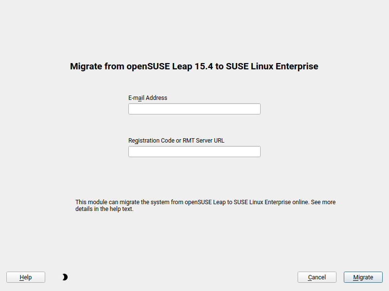

# YaST SLE Migration Module

[](
https://github.com/yast/yast-migration-sle/actions?query=branch%3Amaster)
[](
https://ci.opensuse.org/view/Yast/job/yast-yast-migration-sle-master/)
[](https://coveralls.io/r/yast/yast-migration-sle?branch=master)



## Description

This YaST module allows online migration from the openSUSE Leap distribution to
the SUSE Linux Enterprise (SLE) product. The migration is done in a live
running system.

It uses the [yast2-registration](https://github.com/yast/yast-registration) and
[yast2-migration](https://github.com/yast/yast-migration) modules as the backend.
That means it provides the very same functionality which can be done using these
two modules but in a simplified way.

For migrating to SLES you need a SLES registration key, see https://www.suse.com/support/
how to obtain it. You can create a 60-day trial activation code at
https://www.suse.com/download/sles/ (you need to have a SUSE account for that).

### Features

- Simplified workflow for migrating openSUSE Leap installations
  to SUSE Linux Enterprise (SLE) product
- Can register against [SUSE Customer Service](https://scc.suse.com/) (SCC)
  server or any local [RMT](https://github.com/SUSE/rmt) or SMT server
- Supports [rollback](#rollback) when the migration fails or is aborted
- Because openSUSE Leap shares many packages with SLE the migration should
  usually install just few packages, it should not completely reinstall the system

### Workflow

1. Online update check - at the beginning the module checks whether there is
   an update for software stack and asks to install it. This should ensure the
   package installation later works fine. If an update for this module is needed
   it should be marked as a software stack update as well.
2. Entering the registration data - the module asks for the e-mail address and
   the SLE registration code, alternatively you can enter the address of the local
   RMT/SMT server (email and registration code are not required in that case)
3. Registration - the system is registered to the registration server and
   the openSUSE Leap repositories from the server are added into the system
4. Selecting a migration - if only one migration to a SLE product is available
   then it is automatically selected, if there are multiple migrations a selection
   dialog is displayed and the user needs to select the migration manually
5. Migration - the registration is then migrated to the selected SLE product and the
   Leap repositories are changed to the SLE repositories
6. License agreement - displays the SLE product license and requires accepting it,
   if the license is not accepted the migration is aborted (see the [rollback](
   #rollback) section below)
7. Migration summary - the dialog displays the summary about the installed or
   upgraded products and packages, if there is a package dependency problem
   then it needs to be manually resolved before continuing
8. Package installation - the SLE packages are installed into the system, this can
   take some time
9. Congratulation - a congratulation dialog is displayed to confirm a successful
   migration
10. Reboot - it is recommended to manually reboot the system to ensure all changes
   take effect

#### Rollback

When the migration fails or is aborted then YaST restores the original
repositories in the system and moves the registration from SLE back to openSUSE
Leap. However, the system still remains in a registered state.

If you want to fully unregister the system then run this command as `root`:

```shell
SUSEConnect --de-register
```

## Development

This module is developed as part of YaST. See the
[development documentation](http://yastgithubio.readthedocs.org/en/latest/development/).

### Getting the Sources

To get the source code, clone the GitHub repository:

```shell
git clone https://github.com/yast/yast-migration-sle.git
```

If you want to contribute into the project you can
[fork](https://help.github.com/articles/fork-a-repo/) the repository and clone your fork.


### Development Environment

The module is developed only for the openSUSE Leap product, the functionality
does not make sense for other products.

### Testing

You can run the module directly from the Git sources provided all dependencies
(esp. `yast2-registration` and `yast2-migration`) are installed in the system.

Just run this command:

```shell
# graphical mode (if available)
rake run
# force text mode
DISPLAY="" rake run
```

## Contact

If you have any question, feel free to ask at the [development mailing
list](http://lists.opensuse.org/yast-devel/) or at the
[#yast](https://web.libera.chat/#yast) IRC channel on libera.chat.
